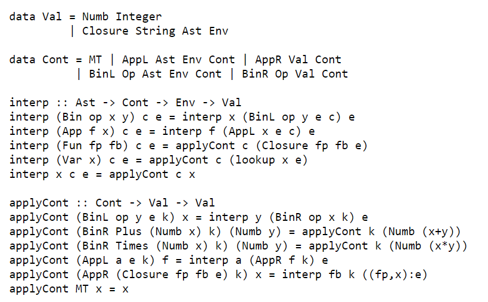

  

## What it does

This racket interpreter uses C to token, parse, and interpret Racket (a dialect of Scheme). 
The following is a proof-of-concept Haskell code demonstrating the inner-workings of the interpreter: 

  

## How we built it

The interpreter is built in C, using trampolining to work around the fact that C’s type system isn’t sophisticated enough to express a function that could return a pointer to itself. 

## Setup guide

Compile F3main.c using c99. The compiled program will take a Racket program from standard input, and display the simplified expression in standard output. 
